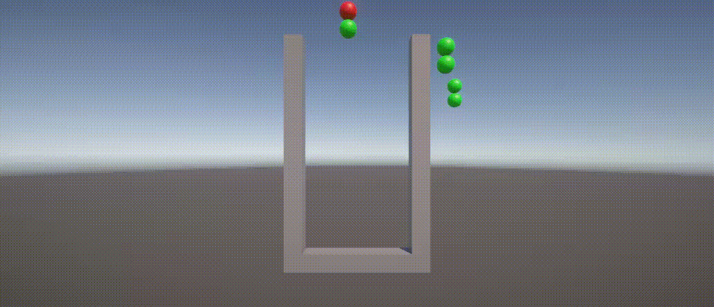
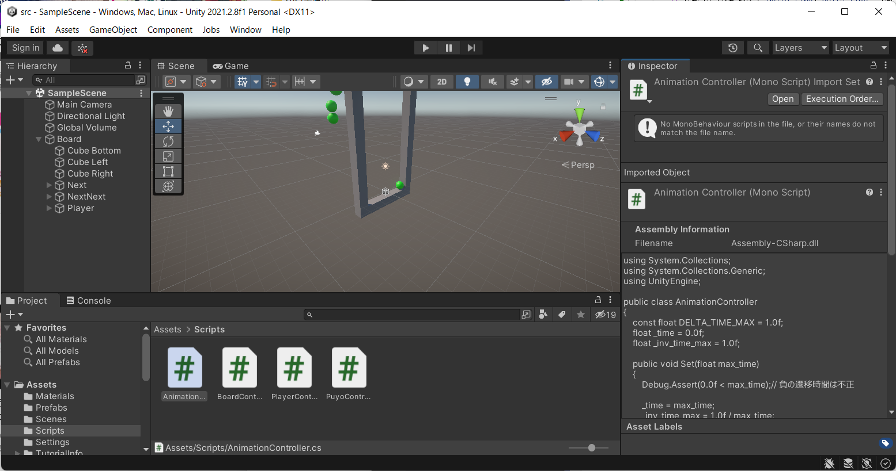
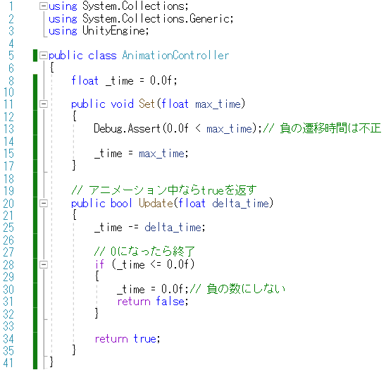
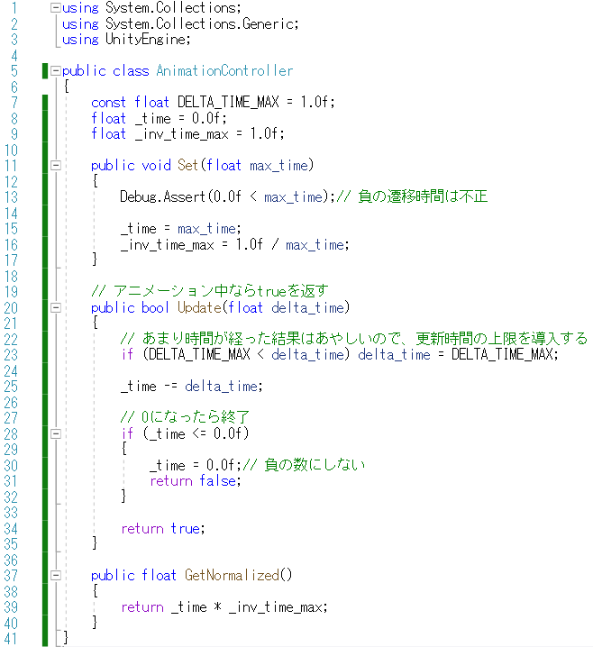
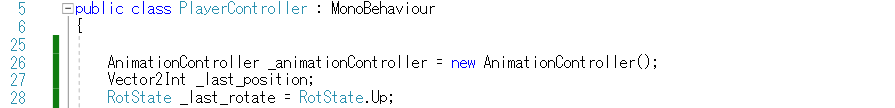
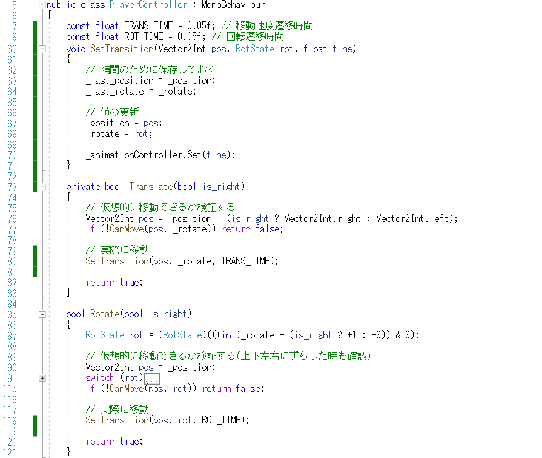
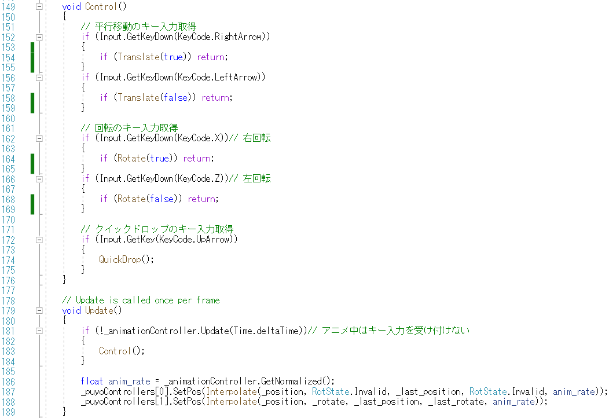
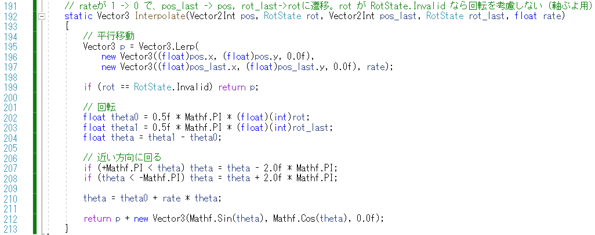

# 概要
今までは入力をすると、瞬間的に移動・回転をしました。
何フレームかかけて移動して、アニメーションさせて見ましょう。

# 手順

## 遷移を管理するクラスの導入
アニメーション中かどうかを管理するクラスを導入してみます。
多少大げさな気がしますが、職責の分離は明確になります。
- Assets の Scripts に C# Script を追加して、名前「AnimationController」をつける

## AnimationController の実装

### 残り時間管理
AnimationController では、更新時間を受け取って、だんだんと残り時間を減らしていきます。
残り時間が正であればアニメーション中と判断します。

- クラス名の後に入っている「: MonoBehaviour」を削除
  - 今回、シンプルな普通のC#クラスを作ってみます。MonoBehaviour は様々な機能が入っているので、あえて外してみます。
- 「_time」メンバーを追加 (8行目)
  - 時間管理するための変数を用意します。
- アニメーションする時間を設定する「Set」メソッドを追加 (11-17行目)
  - 念のため、負の数が入ってこないかチェックする (13行目)
- 時間を更新する「Update」メソッドを追加 (20-35行目)
  - 前に呼ばれた時からの更新時間（delta_time）を受け取る
  - delta_time だけ時間を減らす
  - 減らした時間が負になったらアニメーションを終了する
    - 今後、何度も呼ばれても大丈夫なように負になったら0にしておく

### 更新時間の上限の設定

更新時間が大き過ぎるときは、他のアプリに切り替わったなど、システム的な停止が考えられます。
更新時間の上限を設定して、残り時間を急には減らしすぎないようにします。
- 更新時間の上限の値の設定 (7行目)
  - 定数値は const 等を使って名前を付けましょう
- 更新時間を上限で抑える (23行目)

まだ説明していない部分は次につながります。

### 正規化時間の取得

アニメーション処理に実際に必要なのは、遷移が何パーセント進んだのかという情報です。
今回は、アニメーション開始時は1，アニメーションが終わったら0になる正規化時間を作ってみます。
正規化時間は、元の遷移時間で現在の残り時間を割れば良いです。

- 「_inv_time_max」メンバーを追加 (9行目)
  - 元の正規化時間を保存しておきます。ただし、CPUは割り算より掛け算の方が早い傾向にあるので、掛け算で処理できるように、最初に逆数にして保存します。
- 遷移時間設定時に「_inv_time_max」メンバーを初期化 (16行目)
- 正規化時間を取得する「GetNormalized」メソッドを追加 (37-40行目)
  - 残り時間と、遷移時間の逆数をかけて正規化時間とします (39行目)

## PlayerControllerの修正

次にAnimationControllerを使う処理をPlayerControllerに追加します。

### メンバーの追加

AnimationController や、その他に使う変数をメンバーに追加します。
- AnimationController の追加(26行目)
- 遷移前の位置「_last_position」、向き「_last_rot」の保存(27-28行目)

### 遷移時間の設定

アニメーションの時間を設定するコードを追加します
- 遷移時間の値の設定 (7-8行目)
  - 定数として設定します
  - 平行移動と回転の移動速度を変えられるようにしておきました
- 遷移時間のを設定するメソッド「SetTransition」の追加
  - 呼ばれる前の位置と向きを保存しておく (63-64行目)
  - 位置や向きを更新 (67-68行目)
  - AnimationController に時間を指定 (70行目)
- 平行移動、回転を行う際に、直接ぷよの表示を変えるのではなく「SetTransition」に置き換え
  - 平行移動の目的値の設定 (80行目)
  - 回転の目的値の設定 (118行目)

ぷよの表示位置を更新するコードは別に追加しなければなりません（この後に続く）

### アニメーション中はキー入力は受け付けない

動いている途中ではキー入力を受け付けないように処理を変更します

- キー入力処理を「Control」メソッドとして抜き出し (149-176行目)
- 「Update」内でアニメーションを更新 (181行目)
  - アニメーションしていなければ、「Control」メソッドを呼び出す
- 正規化時間を用いてぷよを補間しながら表示 (186-188行目)
  - 正規化時間1で_last_pos, _last_rotの状態になり、正規化時間0で_pos, _rotの状態になる補間関数を導入して、位置を計算して設定
    - 毎フレーム位置を設定
      - 強制的に位置を指定するので、確実ではあるが、オブジェクト指向としてはいまいち
  - 軸ぷよはrotの影響を受けないので、RotStateにInvalidを指定することで軸ぷよか判定できるようにする (187行目)

### 位置の補間

- 平行移動は線形補間 (195-197行目)
- 軸ぷよは線形補間の結果を使ってもらう (199行目)
- 回転は最初の向きから目的の向きに、近い方向で回転する (210行目)
  - 「近い方向」は、回転の角度を [-π, π] の範囲に周期的に丸める (20-208行目)
- 距離1.0で角度0が上向きになるように平行移動の位置からずらす

